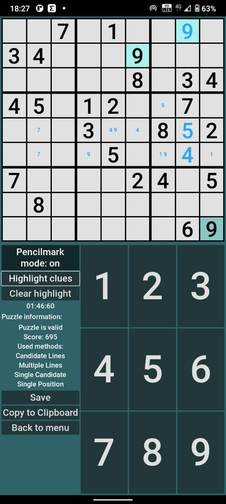
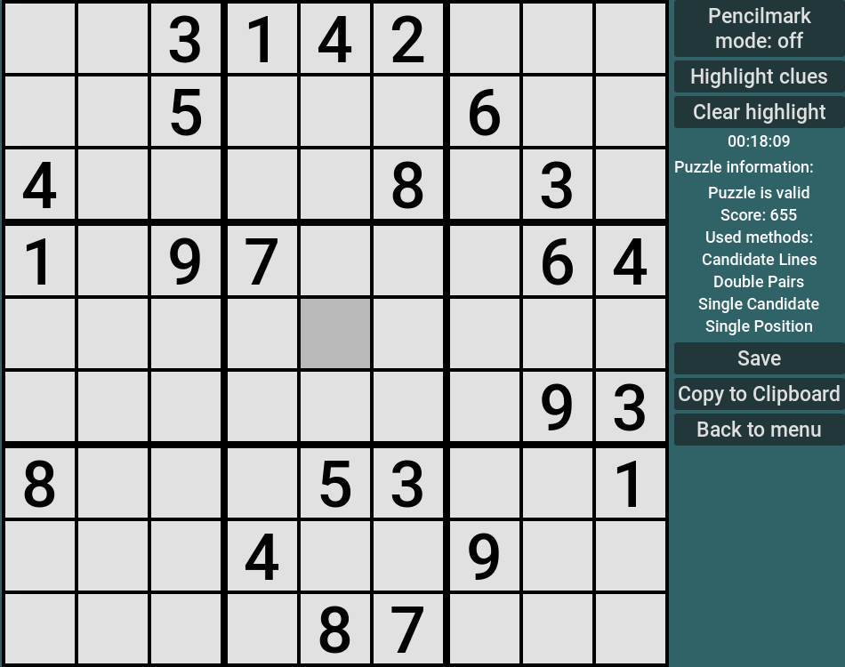

# Gudoku - Sudoku solving app

App for Sudoku solving written using awesome [Godot Engine](https://godotengine.org/).

> [!WARNING]
> This is still in intense development! Bugs expected!

<!--toc:start-->
- [Gudoku - Sudoku solving app](#gudoku-sudoku-solving-app)
  - [Features](#features)
  - [Shortcuts](#shortcuts)
  - [How to install](#how-to-install)
    - [Windows, Linux](#windows-linux)
    - [Android](#android)
  - [How to build](#how-to-build)
  - [Plans](#plans)
  - [How you can help](#how-you-can-help)
<!--toc:end-->

## Features

    
    

* Fully open-source and adds-free.
* Linux + Windows + Android support.
* In-app Sudoku generation and difficulty checking using [Sudoku C++ Library](https://github.com/dudozermaks/sudoku_lib).
* Keyboard oriented desktop app. Use `hjkl` and `m` to move across the grid. More shortcuts are below.

## Shortcuts

| Shortcut           | Action |
| ------------------ | ------ |
| `1-9`              | Toggle some number. |
|`hjkl` and `arrows` | Move across the grid. |
|`m` + `1-9` + `1-9` | Move across the grid. First number represents number of big square, second number represents number of small square. E.g. `m12` will move you to x=0 y=1, `m46` to x=2 y=4. |
|`/`                 | Switch between pencilmarks and clue mode|
|`c`                 | Toggle clue mode. |
|`p`                 | Toggle pencilmark mode. |
|`H` + `1-9`         | Highlight number. |
|`HH`                | Clear highlight. |
|`s`                 | Save puzzle. |

## How to install

### Windows, Linux

1. Grab latest release for your platform (`.zip` archive).
1. Unarchive it to some folder on your computer.
1. Launch `Gudoku` executable.
1. *Optional*: Create [shortcut](https://support.microsoft.com/en-us/office/create-a-desktop-shortcut-for-an-office-program-or-file-9a8df64b-cd87-4700-95cc-4bc3e2a962da) to Gudoku for quick access from desktop.

* if you are using nixos, and binary does not run, check out [this](https://unix.stackexchange.com/a/522823/588681)

### Android

1. Grab latest released `.apk`.
1. Launch it on your phone.

Little tip for Android users. For all of my open-source apps, I use app manager [Obtainium](https://github.com/ImranR98/Obtainium). Because this project is currently only on GitHub, you can't receive updates automatically if you only install `.apk`. But Obtainium can help you with this.

## How to build

1. Grab (or build yourself) [SudokuLib binding](https://github.com/dudozermaks/sudoku_lib_godot) for your platform and put it into `bin` folder.
2. Export project in Godot.

## Plans

* Write better building documentation (build with godot-headless, for example)
* Better generating engine with options.
* Better file manager, especially for Android. There are [PR to Godot](https://github.com/godotengine/godot/pull/83480), adding support for native file picker, but no one knows when it will be done and merged : (. And, as far as I know, there are no Android native file piker openers for Godot now.
* Add colors to the grid.
* Multiple selection.
* Scanning Sudoku from image.
* Parsing Sudoku from websites.
* Built-in wiki with Sudoku methods description and app in general.
* Statistics for solved puzzles.
* Replay of solving.
* Undo and redo.
* New kinds of puzzles (like Killer Sudoku, and many others)

## How you can help

**If you know Java**, you can write [Android plugin](https://docs.godotengine.org/en/stable/tutorials/platform/android/android_plugin.html) that can open Android's native file manager.

If you are good at designing in Godot, you can help improve app design. Gudoku lacks good UI...

You can provide feedback about your experience with Gudoku in Issues tab. I'll be very glad if you do this
